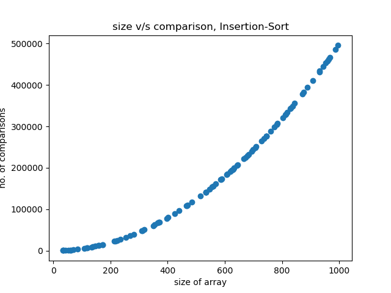
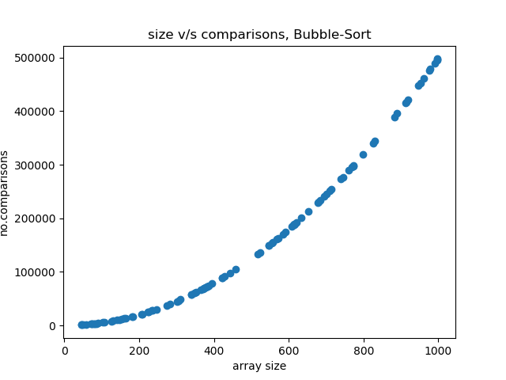
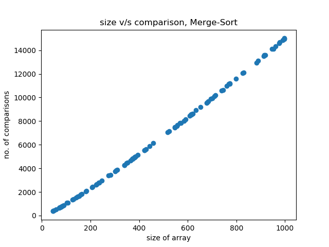
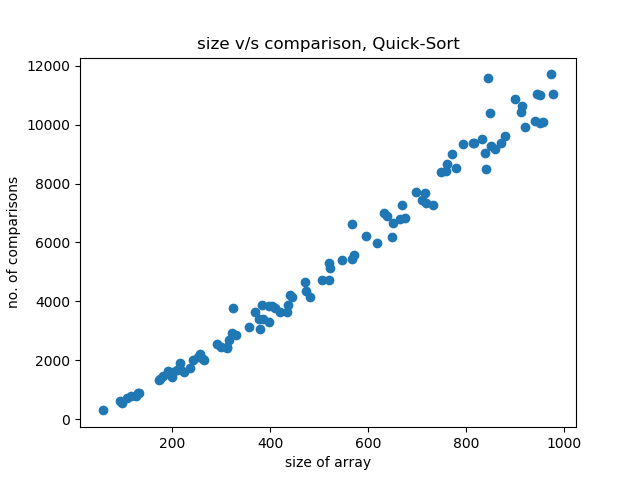

# yet-another-C++-Sortings
Yet another C++ Sorting repository on Github. These are done during my under-graduation, so I thought why not to share these here for better reach :)

Below are **size v/s comparisons** plot for these sortings :-

# Selection Sort

# Insertion Sort

# Bubble Sort

# Merge Sort

# Quick Sort

